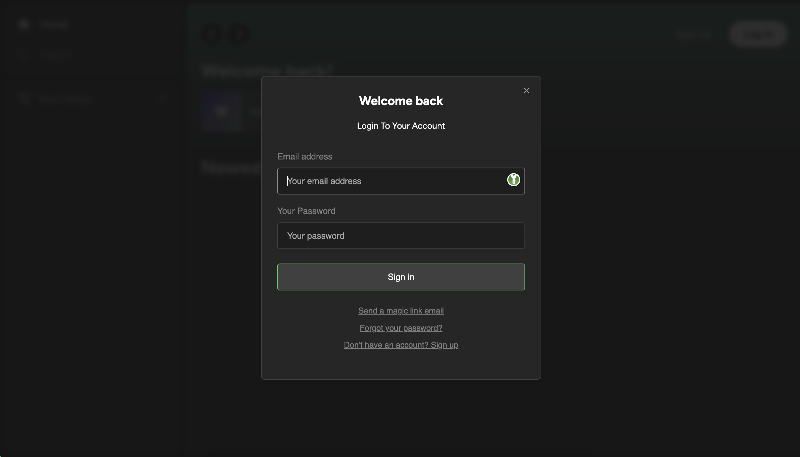
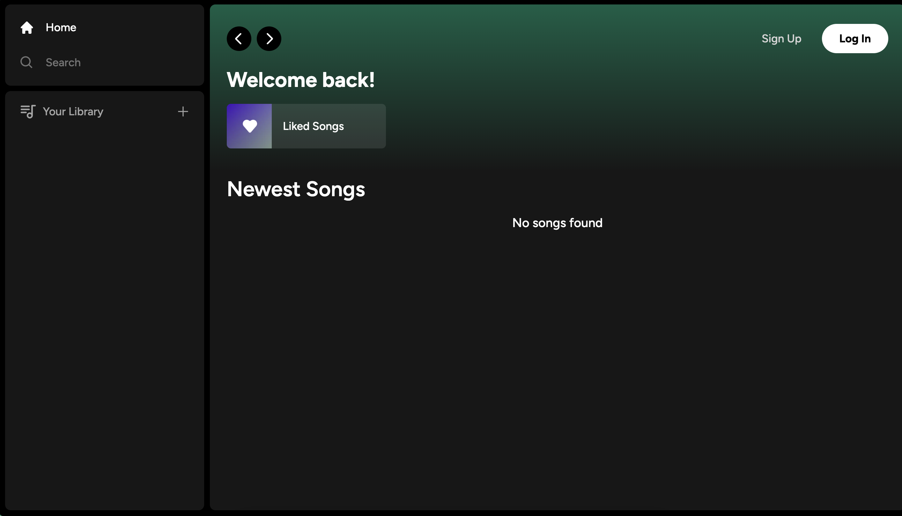
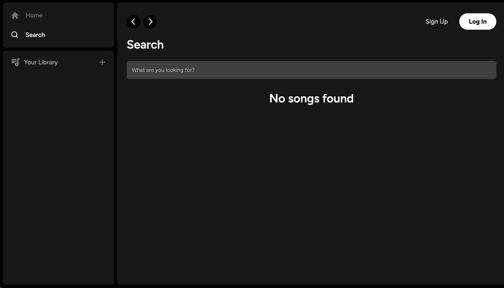
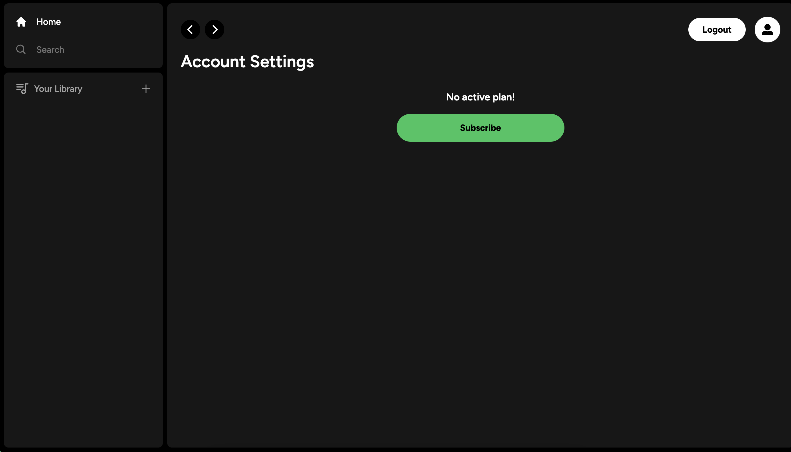

# Spotify Clone

## Description

A Spotify clone built with Next.js, Tailwind CSS, Supabase, and Stripe.

## Technologies

- Next.js
- Tailwind CSS
- Supabase
- Stripe

## Features

### 10/01/2024

- [x] Loading Animations
- [x] Responsive Design
- [x] Dark Mode
- [x] View Songs
- [x] Login
- [x] Like Songs
- [x] View Liked Songs
- [x] Search Songs
- [x] Play Songs
- [x] View Account - Manage Subscription
- [x] Upload Songs (Premium)

## Some Possible Features

- [ ] Create Playlists
- [ ] View Playlists
- [ ] View Artists
- [ ] View Albums
- [ ] View Recently Played
- [ ] View Queue
- [ ] View History
- [ ] Improve Player UI
- [ ] Improve Search UI
- [ ] Improve Account UI

## Screenshots

## Important commands

### Supabase commands

- npx supabase login
- npx supabase gen types typescript --project-id $PROD_ID --schema public > types_db.ts

### Stripe commands

- stripe login
- stripe listen --forward-to localhost:3000/api/webhooks

Sample trigger: stripe trigger payment_intent.succeeded

## How to run

1. Clone the repository
2. Run `npm install`
3. Run `npm run dev`
4. Run stripe command above

Note: Completed by following a tutorial
